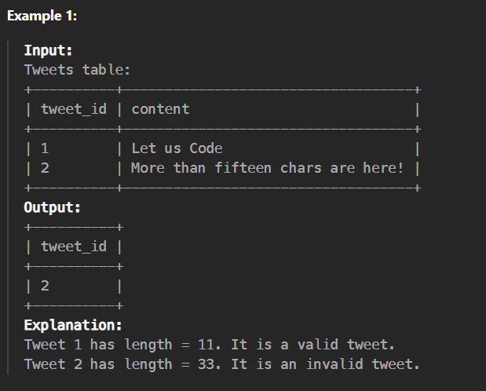

## invalid-tweets

``` bash
https://leetcode.com/problems/invalid-tweets/description/?envType=study-plan-v2&envId=top-sql-50
```


> Determine the length use length() this functino. In that question find the longest content given in the table.